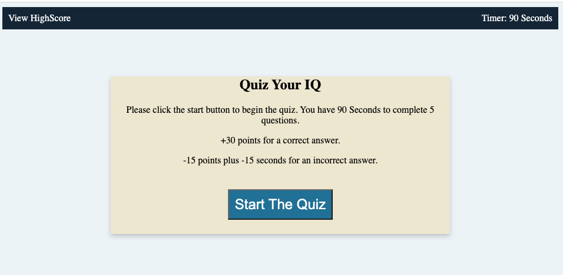

# 04 Web APIs: Code Quiz
# Dependencies
 - HTML
 - CSS
 - Javascripts
## Project

This project lean how to manipulate the DOM elements using Javascript.

## Criteria

```
When you click start to take the quiz
The timer will count down
Each correct answer the quizer will have 30points
An incorect answer the quizer will loss 15 points also minus 15 seconds from the timers
When all the question are asnwered or the time reach 0 the quiz will stop.
Then the quizer can enter the name to save the record.
```

# Usage
 You can run a local copy of this site by issuing the following commands. 
```bash
$ git clone https://github.com/vi3t4lov3/Code-Quiz.git
$ cd HW4-Code-Quiz
```
## Contributing
1. Fork it
2. Create your feature branch (`git checkout -b my-new-feature`)
3. Commit your changes (`git commit -am 'Add some feature'`)
4. Push to the branch (`git push origin my-new-feature`)
5. Create new Pull Request
## The Demo Page
https://vi3t4lov3.github.io/Code-Quiz/




